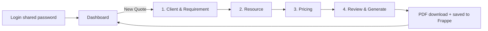

# ITC Internal Quote Tool — Development Plan

A webapp for generating client quotes when deploying internal/external consultants on projects. Pulls employees and customers from Frappe, computes tiered pricing (Good / Better / Best) with a sliding scale and minimum bill floor, produces a signed-off PDF quotation, and tracks every quote in both Frappe and an in-app dashboard.

**Deployment target:** Vercel · **Backend of record:** existing Frappe instance · **Auth:** simple shared login

---

## 1. Confirmed decisions

| Decision | Choice |
|---|---|
| Base pricing | CTC × margin multiplier (all factors admin-configurable) |
| External consultant cost | Pull from Frappe Supplier record if it exists; manual entry/override otherwise |
| Signatures | Three static signature blocks on the PDF (Recruiter, Finance Manager, Director) |
| Login | Single shared password for the internal team (no per-user roles) |
| Hosting | Vercel (Next.js) |

## 2. Assumptions (flag if wrong)

1. **Currency is INR** ("CTC" convention). Stored as a config value so it can change.
2. **"Skills (Nice/regular)"** is interpreted as **Niche vs Regular** skill set — niche skills carry a price premium. Rename trivially if it means something else.
3. **Customer priority** is a Select field (P1‑Strategic / P2‑Preferred / P3‑Standard) added to the Frappe Customer doctype; higher priority ⇒ bigger discount + request handled first.
4. **CTC lives on the Employee record** as a custom currency field (`custom_ctc_annual`). If you already store CTC in Salary Structure, we swap the fetch — one function change.
5. **PDF template will be provided.** Until then, the app ships with a placeholder template containing every required field so the swap is layout-only.
6. Quotes are tracked in Frappe via a **custom doctype** (`Consultant Quote`) rather than the stock Quotation doctype — the stock one is item/stock oriented and fights this use case. (Optionally mirror to stock Quotation later if ERP reporting needs it.)

## 3. Architecture

```
Browser ──► Next.js (Vercel)
              ├── UI (React, App Router)
              ├── /api/* route handlers  ←— all Frappe calls happen server-side
              │     └── Frappe REST API (token auth: api_key:api_secret)
              └── /api/quotes/[id]/pdf   ←— server-side PDF generation
Frappe site ── Employees, Customers (+priority), Suppliers, Consultant Quote doctype
```

- **Frappe credentials never reach the browser.** All reads/writes proxy through Next.js route handlers using a service-account API key/secret from Vercel env vars.
- **Caching:** employee/customer lists cached server-side ~5 min (revalidate on demand) so pickers feel instant; a "refresh" button busts the cache.
- **Source of truth:** the quote record is written to Frappe on save; the app dashboard reads from Frappe, so both stay in sync by construction. Generated PDFs are attached to the Frappe record (File doctype).

### Tech stack

| Layer | Choice | Why |
|---|---|---|
| Framework | Next.js 15 (App Router, TypeScript) | Vercel-native, server routes for secret-safe Frappe calls |
| Styling | Tailwind CSS v4 + CSS variables | Fast, themeable |
| Data fetching | TanStack Query | Cache, optimistic updates, retry on flaky Frappe |
| Forms/validation | React Hook Form + Zod | One schema validates UI and API |
| PDF | `pdf-lib` (fill provided template) with `@react-pdf/renderer` fallback if template arrives as a design, not a fillable PDF | Works in Vercel serverless |
| Charts (dashboard) | Recharts | Simple, sufficient |
| Auth | Signed httpOnly session cookie set after shared-password check (`iron-session`) | Matches "simple shared login" |

## 4. Frappe setup — works on any existing instance

Do these once on the Frappe site (Desk UI, no bench access required):

1. **Service user + API keys**
   - Create user `quote-tool@yourco.com` (role: a new role `Quote Tool API` is cleanest).
   - User → Settings → API Access → *Generate Keys* → note `api_key` + `api_secret`.
   - Grant the role read on Employee, Customer, Supplier; read/write/create on `Consultant Quote` and File.
2. **Custom fields** (Customize Form):
   - `Customer` → `custom_priority` (Select: `P1 - Strategic`, `P2 - Preferred`, `P3 - Standard`, default P3).
   - `Employee` → `custom_ctc_annual` (Currency) — skip if CTC already exists somewhere; point the app at that fieldname instead.
   - `Supplier` → `custom_monthly_rate` (Currency) + `custom_is_consultant` (Check) to filter the external-consultant list.
3. **Custom doctype `Consultant Quote`** — created via a provided **fixtures JSON** (importable through Desk → Data Import or one `bench` command). Fields listed in §5.
4. **Verify from the app**: the webapp ships a **Settings → Connection Test** screen that checks URL reachability, token validity, each doctype/fieldname, and permissions — with a specific fix-it message per failure. This is the "integrate any Frappe instance" story: enter URL + key + secret, run the test, done.

Vercel env vars:

```
FRAPPE_URL=https://your-site.frappe.cloud
FRAPPE_API_KEY=xxxx
FRAPPE_API_SECRET=xxxx
APP_PASSWORD=<shared login password>
SESSION_SECRET=<random 32+ chars>
```

## 5. Data model — `Consultant Quote` doctype (mirrored as app types)

| Field | Type | Notes |
|---|---|---|
| naming series | `CQ-.YYYY.-.####` | Quote number, printed on PDF |
| customer | Link Customer | |
| customer_priority | read-only copy at quote time | Priority may change later; quote keeps snapshot |
| resource_type | Select: Internal / External | |
| employee / supplier | Link (one of) | |
| resource_name | Data | Denormalized for display |
| monthly_cost | Currency | CTC/12 or vendor rate (possibly manual) — **internal only, never printed** |
| years_experience | Int | |
| certification_required | Check | |
| certification_held | Check | See scenario E3 |
| skill_type | Select: Niche / Regular | |
| duration_months | Int | |
| budget_per_month | Currency | From the client requirement |
| tier_selected | Select: Good / Better / Best / Custom | |
| price_good / price_better / price_best | Currency | Snapshot of all three |
| min_bill_amount | Currency | Computed floor, snapshot |
| final_monthly_rate | Currency | Slider value actually quoted |
| total_contract_value | Currency | rate × duration |
| discount_pct_applied | Percent | |
| status | Draft / Generated / Sent / Approved / Rejected / Expired | Workflow states |
| valid_until | Date | Default +30 days |
| prepared_by / notes | Data / Text | |
| pricing_config_snapshot | JSON (Long Text) | Exact multipliers used — auditability |
| pdf attachment | File | Generated PDF attached on generation |

**Pricing config** lives in the app as an admin-editable settings record (stored in Frappe as a single `Quote Tool Settings` doc so it's tracked too): tier multipliers, adjustment percentages, priority discounts, minimum margin, currency, validity days.

## 6. Pricing engine

All numbers below are **editable defaults** in Settings — the engine is a pure function `(inputs, config) → PriceSheet`, unit-tested, with the config snapshot saved on every quote.

```
monthly_cost   = CTC / 12            (internal)  |  supplier/manual rate (external)
adjusted_cost  = monthly_cost × (1 + expAdj + certAdj + skillAdj)

  expAdj:   0–3y: 0% · 3–6y: +5% · 6–10y: +10% · 10y+: +15%
  certAdj:  +5% when certification required AND held
  skillAdj: Niche +10% · Regular 0%

tier_price(t)  = adjusted_cost × tierMultiplier(t) × (1 − priorityDiscount)

  tierMultiplier: Good 1.40 · Better 1.60 · Best 1.85
  priorityDiscount: P1 10% · P2 5% · P3 0%

min_bill       = adjusted_cost × minMargin (default 1.15)   ← hard floor
final_rate     = slider value ∈ [min_bill, price_best × 1.1], snaps to tier marks
total          = final_rate × duration_months
```

**Worked example:** CTC ₹24L → 2,00,000/mo; 7 yrs (+10%), niche (+10%), cert not required ⇒ adjusted 2,40,000. P2 customer (−5%): Good ₹3,19,200 · Better ₹3,64,800 · Best ₹4,21,800. Floor ₹2,76,000. Client budget ₹3,50,000/mo ⇒ UI shows Good ✅ fits, Better ⚠ 4% over, Best ❌ over budget.

**Sliding scale UX:** one horizontal slider. Red zone below floor (unreachable), tick marks at Good/Better/Best, a budget line overlaid. Dragging updates margin % and total contract value live. Numbers use tabular figures; margin badge goes amber near floor.

## 7. UX flows

### Personas & jobs

- **Recruiter** (primary): gets a requirement, needs a client-ready PDF in <2 minutes.
- **Finance/Director**: signs the printed/emailed PDF; occasionally checks the dashboard for margin health.

### Flow A — Create a quote (the happy path, 4-step wizard)



1. **Client & Requirement** — searchable Customer picker (priority badge shown inline, e.g. gold `P1` chip), duration (months stepper), budget/month, requires-certification toggle, skill type (Niche/Regular segmented control), years-of-experience needed.
2. **Resource** — Internal/External toggle.
   *Internal:* employee search with avatar, designation, experience; CTC shown to recruiter but styled as internal-only (lock icon).
   *External:* supplier list (filtered `custom_is_consultant`) **or** "New vendor" inline form (name + monthly cost) — manual entry allowed even for listed suppliers (override with reason note).
   Mismatch warnings appear here (candidate has 4 yrs, requirement says 6+ ⇒ non-blocking amber banner).
3. **Pricing** — the centerpiece. Three tier cards (Good/Better/Best) each showing monthly rate, total contract value, margin %, and budget-fit indicator; click a card or drag the slider for a custom rate. Floor and budget rendered on the slider track. A collapsible "how was this calculated" breakdown shows every multiplier (trust + training).
4. **Review & Generate** — full summary, editable inline; validity date; prepared-by name (free text, since login is shared); **Generate PDF** → streams the file, sets status `Generated`, writes to Frappe with PDF attached.

Draft autosave at every step (localStorage + Frappe draft on step change) — nothing lost to a closed tab.

### Flow B — Quote lifecycle

`Draft → Generated → Sent → Approved / Rejected / Expired`
Status changed from the quote detail page (one-click "Mark sent/approved/rejected"); `Expired` flips automatically past `valid_until`. Every change patches Frappe. **Revision:** a Generated+ quote is immutable; "Revise" clones to `CQ-…-R2` linked to the original.

### Flow C — Dashboard (landing page)

- KPI row: quotes this month, pipeline value, win rate, avg margin %.
- Status funnel + monthly trend chart.
- Table: recent quotes (number, client + priority chip, resource, rate, status pill, actions: view / PDF / revise / mark status). Filter by status/customer/date.
- Same numbers visible in Frappe via a standard Dashboard/Report on the doctype (list view with status filters comes free; a Frappe Dashboard Chart config is included in fixtures).

### Visual direction (frontend-design)

Internal finance tool ≠ generic admin template. Direction: **"the ledger" — refined editorial-financial**. Warm paper background (`#FAF7F2`), ink text (`#1A1A18`), deep bottle-green accent for money/actions, oxblood for warnings/floor. Display serif **Fraunces** for headings and big numbers, **Archivo** for UI text, tabular numerals everywhere money appears. Tier cards feel like banknote engravings (fine-line borders, subtle guilloché texture on the selected card). Restrained motion: staggered reveal on dashboard load, slider thumb with spring snap to tier marks. Dark mode later, not v1.

## 8. PDF output

- Filled server-side in a route handler; returned as download **and** attached to the Frappe record.
- Contents: company header, quote number + date + validity, client block, resource profile (name, experience, certification, skill type — **no CTC/cost/margin ever printed**), engagement terms (duration, monthly rate, total value, discount if any shown per your preference — config flag), terms text block, and **three signature blocks**: Recruiter, Finance Manager, Director (name/date/signature lines).
- Template pipeline: if your provided template is a fillable PDF (AcroForm) → `pdf-lib` fills fields by name; if it's a design file → recreated with `@react-pdf/renderer` pixel-close. Placeholder template ships day 1 so nothing blocks on the template.

## 9. Scenario & edge-case handling

| # | Scenario | Handling |
|---|---|---|
| E1 | Employee has no CTC in Frappe | Picker shows "CTC missing" badge; selecting prompts manual cost entry (flagged `manual_cost` on quote) + a "fix in Frappe" deep link |
| E2 | Budget < minimum bill | Big amber callout on Pricing step: "Budget ₹X is below floor ₹Y" — quote still allowed (client may negotiate) but PDF-generation confirm dialog restates it |
| E3 | Cert required, candidate lacks it | Non-blocking warning at Resource step; `certification_held=No` recorded; no cert premium applied |
| E4 | External vendor not in Frappe | Inline manual vendor entry; optional one-click "create Supplier in Frappe" |
| E5 | Frappe unreachable | Cached lists keep pickers working (stale badge shown); quote saves queue locally and retry; banner shows connection state |
| E6 | Priority changed after quote | Quote keeps snapshot; revision picks up new priority |
| E7 | Discount pushes price under floor | Engine clamps to floor; UI explains "priority discount limited by minimum margin" |
| E8 | Duration 0 / negative / >36 months | Zod validation; >24 months gets a soft "confirm long engagement" nudge |
| E9 | Two people edit same quote (shared login) | Frappe `modified` timestamp checked on save → conflict toast with reload option |
| E10 | Quote expired | Auto-status `Expired`; "Revise" is the only action |
| E11 | Pricing config changed later | Old quotes unaffected — config snapshot stored per quote |
| E12 | Currency/formatting | Single config; `Intl.NumberFormat` throughout, lakh/crore grouping for INR |

## 10. Build phases

| Phase | Scope | Est. |
|---|---|---|
| **0. Foundation** | Next.js scaffold, Tailwind theme, shared-password auth, Frappe client + Connection Test screen, fixtures JSON for doctype/custom fields | 2–3 d |
| **1. Pricing engine** | Pure function + unit tests (all E-cases), Settings screen persisted to Frappe | 2 d |
| **2. Quote wizard** | 4 steps, pickers, warnings, autosave, save to Frappe | 4–5 d |
| **3. PDF** | Placeholder template, generation route, Frappe attachment; swap in real template when provided | 2 d |
| **4. Dashboard & lifecycle** | KPIs, charts, table, status actions, revision flow, expiry job (Vercel cron) | 3 d |
| **5. Polish & deploy** | Visual refinement per §7, empty/loading/error states, Vercel deploy, seed data walkthrough, README runbook | 2 d |

≈ 3 working weeks solo. Phases 1–3 give a usable end-to-end tool after ~2 weeks.

## 11. Security notes & upgrade path

Shared login = no audit trail of *who* quoted (mitigated by required "prepared by" field) and one credential to leak. Acceptable for a small internal team; when it pinches, swap `iron-session` password check for Frappe OAuth2 SSO — the session layer is isolated so nothing else changes. Frappe secrets stay server-side from day 1; API user is least-privilege.

## 12. Open items (need from you)

1. **PDF template** — whenever ready; fillable PDF preferred.
2. **Real multiplier/discount numbers** — defaults in §6 are placeholders; all editable in Settings anyway.
3. **Confirm "Nice/regular" = Niche/Regular skills** (assumption A2).
4. **Frappe credentials** (URL + API key/secret) when we reach Phase 0 — or use the Connection Test screen yourself.
5. Should discount be **visible on the client PDF** (strikethrough list price) or silent? (Config flag either way.)
